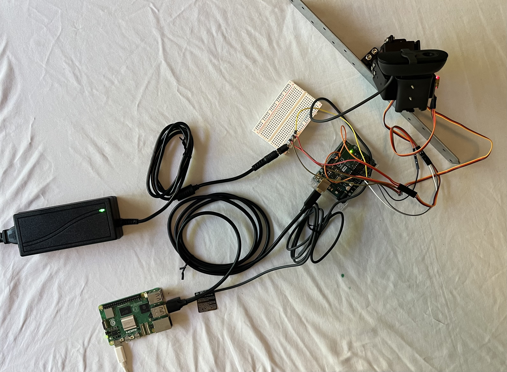
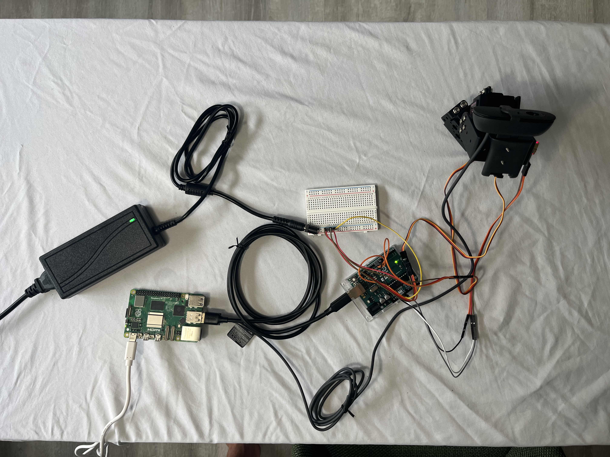
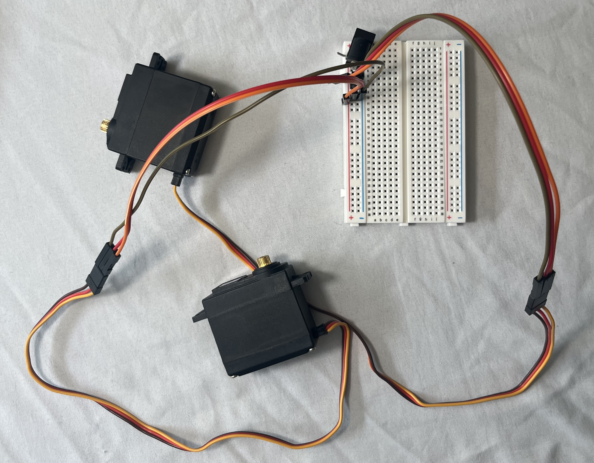

# Pan-Tilt Laser Tracking System

A real-time computer vision system that detects a colored target through a USB
webcam and drives a two-axis pan-tilt servo mount to track the target with a 
mounted laser. The vision and control loop runs on a Raspberry Pi 5; a serial 
link hands servo commands to an Arduino Uno that drives the hardware.



## Demo

https://github.com/DuncNam/pan-tilt-tracker/raw/main/media/demo.mp4

The laser tracks the target smoothly through motion and settles on a stopped target. See [Known Limits](#known-limits) for the
characterized speed and accuracy bounds.

## How It Works

The Pi runs a C++ OpenCV program (`src/tracker.cpp`) that:
1. Captures 1280×720 MJPEG frames at 30 fps from the webcam over V4L2.
2. Masks the target by HSV color, cleans the mask, and finds the largest blob.
3. Computes the blob centroid and its error from the frame center (offset by a
   fixed boresight to account for the laser-to-camera mounting gap).
4. Runs a velocity-form PID controller on that error to produce pan/tilt angles.
5. Converts angles to servo pulse widths and sends them over serial.

The Arduino (`src/servo_control/servo_control.ino`) parses the pulse-width
commands and drives the two servos with `writeMicroseconds()` for sub-degree
resolution.

## Control Approach

The controller is a **velocity-form PID**: each axis accumulates corrections
rather than computing an absolute angle, so the integral term is the running
servo position. In velocity form the three terms map to differences of the
pixel error `e`:

| Term | Acts on | Form |
|---|---|---|
| Proportional | error change | `e_n − e_(n−1)` |
| Integral | current error | `e_n` |
| Derivative | error acceleration | `e_n − 2·e_(n−1) + e_(n−2)` |

Gains were tuned one at a time, each validated against a specific physical
symptom, with every term gate-tested at zero before a nonzero value was
introduced. Tuned values: `KP = 0.04`, `KI = 0.012`, `KD = 0.015`. HSV bounds and
tuning rationale are in [`calibration/tuning.md`](calibration/tuning.md).

## Hardware

| Component | Part |
|---|---|
| Compute | Raspberry Pi 5 (2 GB) |
| Microcontroller | Arduino Uno R3 |
| Camera | Logitech Brio 101 (1280×720 MJPEG @ 30 fps) |
| Servos | 2× MG996R high-torque metal gear |
| Laser | KY-008 650 nm 5 mW |

| | |
|---|---|
|  |  |

## Software Dependencies

- OpenCV 4.x (C++ API)
- Raspberry Pi OS 64-bit
- Arduino IDE + `Servo.h`

## Build & Run

```bash
# On the Pi, from the repo root:
g++ src/tracker.cpp -o tracker $(pkg-config --cflags --libs opencv4)
./tracker
```

Flash `src/servo_control/servo_control.ino` to the Arduino via the Arduino IDE.
The tracker opens the serial port at `/dev/ttyACM0` (115200 baud) and the camera
at `/dev/video0`.

## Known Limits

These are characterized behaviors, not open bugs:

- **Following lag on constant-velocity motion.** A reactive controller has a
  fixed steady-state following error against a moving target. The laser trails
  slightly during steady motion and settles on the target when it stops. Closing
  this would require a feedforward/predictive term, which is future work rather 
  than a tuning fix.
- **Boresight parallax at close range.** The fixed pixel-offset boresight is
  calibrated for the 4–8 ft demo envelope. Inside ~1–2 ft, parallax between the
  camera and laser grows and the laser drifts off the target.

## Future Work

- Feedforward / predictive tracking (velocity estimate or Kalman filter) to
  cancel the steady-state following lag.
- Boresight model that compensates for range rather than a fixed pixel offset.

## Documentation

- [System Requirements](docs/SysReq_PanTiltTracker_v1_1.docx)
- [Assembly Guide](docs/assembly.md)
- [Calibration & Tuning](calibration/tuning.md)